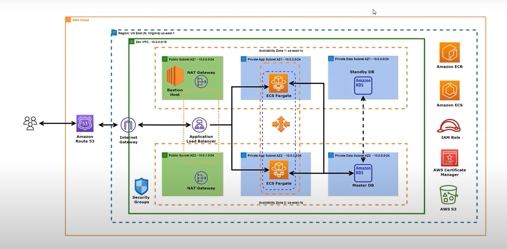

# Rentzone Application Deployment on AWS

## **Project Overview**
The Rentzone application is a dynamic web application deployed on **Amazon Web Services (AWS)** using **Terraform, Docker, Amazon Elastic Container Registry (ECR), and Elastic Container Service (ECS)**. This guide outlines the steps required to set up the infrastructure and deploy the application efficiently.

---

## **Architecture**


---

## **Technologies Used**
- **Cloud Provider**: AWS
- **Infrastructure as Code**: Terraform
- **Containerization**: Docker
- **Orchestration**: ECS with Fargate
- **Storage**: Amazon S3
- **Networking**: VPC, Subnets, Security Groups
- **Security & IAM**: IAM Roles and Policies
- **Load Balancing**: Application Load Balancer (ALB)
- **Database**: Amazon RDS

---

## **Prerequisites**
- AWS Account
- AWS CLI installed on your local machine
- Terraform installed on your local machine
- Docker installed on your local machine
- Git installed on your local machine

---

## **Project Structure**
```bash
rentzone-infra/
├── modules/
│   ├── vpc/                        # Terraform module for VPC
│   ├── ecs/                        # Terraform module for ECS cluster and services
│   ├── rds/                        # Terraform module for database setup
│   ├── alb/                        # Terraform module for Load Balancer
├── scripts/
│   ├── deploy.sh                    # Shell script for deployment automation
├── .gitignore
└── README.md                        # Project documentation
```

---

## **Setup Instructions**

### **1. Create an IAM User on AWS**
1. Log in to the AWS Management Console.
2. Navigate to **IAM (Identity and Access Management)**.
3. Create a new IAM user with `Programmatic access`.
4. Assign the required permissions (e.g., `AdministratorAccess` for development purposes).
5. Generate an Access Key and Secret Key and save them securely.

### **2. Configure AWS CLI with IAM Credentials**
```bash
aws configure --profile <profile-name>
```
Enter the Access Key ID, Secret Key, default region, and output format when prompted.

### **3. Set Up Terraform Backend with S3 & DynamoDB**
1. Create an **S3 bucket** to store Terraform state files.
2. Enable **versioning** on the bucket.
3. Create a **DynamoDB table** with `LockID` as the primary key to handle state locking.
4. Configure the backend in Terraform:
   ```hcl
   terraform {
     backend "s3" {
       bucket         = "<s3-bucket-name>"
       key            = "terraform.tfstate"
       region         = "<region>"
       dynamodb_table = "<dynamodb-table-name>"
     }
   }
   ```

### **4. Clone the Terraform Infrastructure Repository**
```bash
git clone <repository-url>
cd rentzone-infra
```

### **5. Create a VPC with Public and Private Subnets**
Define a Terraform module for a VPC with subnets across multiple availability zones (AZs).

### **6. Set Up Networking Components**
- Create a **NAT Gateway** for private subnets.
- Configure **Security Groups** for the application and database.

### **7. Deploy an RDS Database**
Use Terraform to create an Amazon RDS instance or restore from a previous snapshot.

### **8. Request and Configure ACM SSL Certificates**
1. Use Terraform to request **ACM (AWS Certificate Manager)** SSL certificates.
2. Attach the SSL certificate to the **Application Load Balancer (ALB)**.

### **9. Set Up the Application Load Balancer**
Use Terraform to deploy an **ALB** and associate it with the VPC subnets.

### **10. Deploy an Amazon S3 Bucket for Application Storage**
Create an **S3 bucket** for storing application assets.

### **11. Set Up ECS Cluster and Services**
- Create an ECS **Cluster**.
- Define **Task Definitions** for the application containers.
- Deploy an **ECS Service** that runs the application.

### **12. Implement Auto Scaling for ECS Services**
Configure an **Auto Scaling Group** to dynamically adjust the number of running containers.

### **13. Push Docker Images to Amazon ECR**
1. Authenticate Docker with ECR:
   ```bash
   aws ecr get-login-password --region <region> | docker login --username AWS --password-stdin <aws-account-id>.dkr.ecr.<region>.amazonaws.com
   ```
2. Build and tag the Docker image:
   ```bash
   docker build -t rentzone-app .
   docker tag rentzone-app:latest <aws-account-id>.dkr.ecr.<region>.amazonaws.com/rentzone-app:latest
   ```
3. Push the image to ECR:
   ```bash
   docker push <aws-account-id>.dkr.ecr.<region>.amazonaws.com/rentzone-app:latest
   ```

### **14. Create a Route 53 DNS Record**
- Create a DNS record in **AWS Route 53** pointing to the Application Load Balancer.

### **15. Deploy Infrastructure with Terraform**
```bash
terraform init
terraform apply -auto-approve
```

---

## **Testing the Deployment**
1. Verify ECS tasks are running in the AWS Management Console.
2. Check **CloudWatch Logs** for application logs.
3. Open the application URL in a browser.

---

## **What We Learned**
1. Infrastructure as Code with **Terraform**.
2. Secure **IAM Roles & Policies** for AWS services.
3. **Container orchestration** with ECS & Fargate.
4. Implementing **CI/CD for cloud-native applications**.

---

## **Future Enhancements**
1. Add **monitoring and alerts** using AWS CloudWatch and SNS.
2. Implement **blue/green deployment** with ECS.
3. Optimize **cost efficiency** with Spot Instances.

By following these steps, you will have successfully deployed the Rentzone application on AWS using **Terraform, Docker, Amazon ECR, and ECS**.
